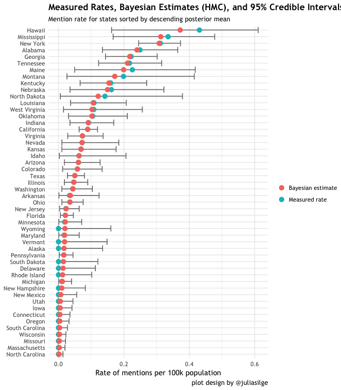
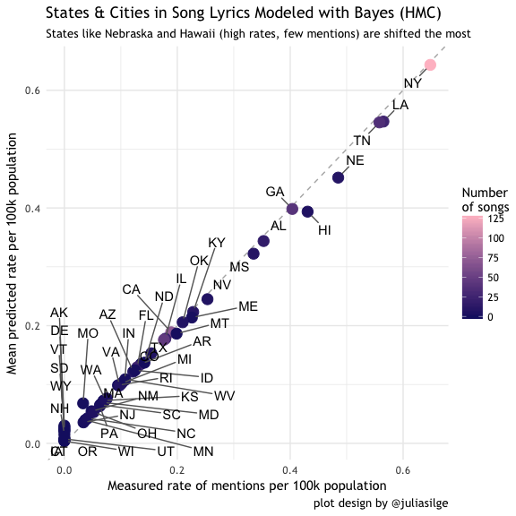

Puttin'a Prior on It: Stan Beta Estmation of Song Lyrics
================
MDH
10/6/2016

-   [Introduction](#introduction)
-   [Get Data](#get-data)
-   [Join, mutate, and munge the data](#join-mutate-and-munge-the-data)
-   [Fun facts...](#fun-facts...)
-   [Parameter estimation](#parameter-estimation)
-   [Hamiltonian Monte Carlo (HMC)](#hamiltonian-monte-carlo-hmc)
-   [Adding City Counts](#adding-city-counts)
-   [Model Comparison](#model-comparison)

Introduction
------------

### Estimating a Beta Distribution with Stan HMC

#### Repository for data, analysis (markdown), and R code

This is a repo to hold the data and code for [my blog post](https://wordpress.com/post/matthewdharris.com/4405) based on Julia Silge's [*Singing the Bayesian Beginner Blues*](http://juliasilge.com/blog/Bayesian-Blues/). The post by Silge is a really fun and interesting analysis of the rate at which song lyrics from *Billboard Hot-100* songs (1958 to present) mention U.S. States by name. In her second post on the subject, Silge used a beta distribution to model this rate. After reading that post, I was inspired to learn more about her method and to follow up on this model with my interests in Bayesian modeling with [Stan](http://mc-stan.org/), a probabilistic programming language. I hoped to repeat Silge's findings while learning how to code her model in Stan. This was also a fun opportunity to work on more `dplyr` data munging techniques. The result was a good learning experience and perhaps a few additional insights into the distribution of state name mentions.

If you are interested in this, please see [my blog post](https://wordpress.com/post/matthewdharris.com/4405) and [Julia's posts](http://juliasilge.com/blog/Bayesian-Blues/). **Note**: the code and analytical process here is based on [Silge's workflow](https://github.com/juliasilge/juliasilge.github.io/blob/master/_R/2016-09-28-Bayesian-Blues.Rmd), but alterations and additions were made to focus on different aspects. Any errors, sloppiness, or misunderstandings are my own. Also, I am sure there are other ways to model these data and while I'd be very happy to hear about them, this post is intended to explore this particular method. Please contact me if you see errors and just to say hi. \[@md\_harris\](<https://twitter.com/Md_Harris>)

### Differences from Silge's Analysis

1.  Is zero inflated to include states not mentioned in lyrics
2.  Incorporates mentions of cities with &gt;= 100k population aggregated to their state and compares to analysis without city counts
3.  Utilizes Hamiltonian Monte Carlo via `rstan` to estimate parameters, propagated uncertainty, and predict new values.

### Why Go Bayes?

Aside from being an interesting data set due to cultural relevance, it is also a really great example of for why one may want to use a Bayesian approach. As described in Silge's post, the simple calculation of a mention rate is unsatisfying because it does not consider the magnitude of each states population. We would prefer a method that incorporates this information and can make a new estimate based on the number of mentions and population each state that therefore *regularizes* the estimates based on all of the information available. This include prior information and empirical data.

In my humble opinion this is a really key point; the reason that Silge utilized the beta distribution to *model* the data (as opposed to simply describe) is because she wanted to show the uncertainty for each estimate based on a states mentions and population. The problem this solves is a state that has a very high rate, but few mentions because it has a low population. This is in opposition to a state that is mentioned many times, but has a lower rate because of a large population. This is the classic "batting average" from illuminated by David Robinson [here](http://stats.stackexchange.com/questions/47771/what-is-the-intuition-behind-beta-distribution).

What the Bayesian approach does is incorporate prior knowledge (e.g. priors) and the uncertainty that comes with balancing values based on only a few data points against values based on many data points; which are likely more reliable. By this, the expectation for a states rate of mention is regularized or drawn towards a central global expectation. States with fewer data points are regularized more than more stable states with lots of data. Finally, the [Credible Interval](https://en.wikipedia.org/wiki/Credible_interval) captures the uncertainty that propagates through this system. Regularization and uncertainty estimation are key reasons why someone may want to use Bayesian methods.

Let's get started!

#### Packages

``` r
library("ggplot2")
library("grid")
library("dplyr")
library("tools")
library("tidyverse")
library("acs")
library("reshape2")
library("readr")
library("tidytext")
library("ggplot2")
library("ggrepel")
library("broom")
library("fitdistrplus")
library("rstan")
library("knitr")
```

Get Data
--------

1.  Use `acs` package to get state population data from 2014
    1.  requires an API from the [Census](http://www.census.gov/developers/)

2.  Grab song lyrics from Kaylin Walker's [repo](http://kaylinwalker.com/50-years-of-pop-music/)
3.  Load `./data/cities_over_100k_pop.csv`, names of cities with &gt;= 100k population
    1.  UNCOMMENT that line `download.file(lyrics_url, save_lyrics_loc)` to run
    2.  you may have to adjust the path

``` r
#api.key.install("YOUR KEY HERE!")
## population data
stategeo <- geo.make(state = "*")
popfetch <- acs.fetch(geography = stategeo, 
                      endyear = 2014,
                      span = 5, 
                      table.number = "B01003",
                      col.names = "pretty")
## song lyrics
lyrics_url <- "https://raw.githubusercontent.com/walkerkq/musiclyrics/master/billboard_lyrics_1964-2015.csv"
save_lyrics_loc <- "~/Documents/R_Local/Put_a_prior_on_it-Blog_post/data/billboard_lyrics_1964-2015.csv"
# download.file(lyrics_url, save_lyrics_loc)
song_lyrics <- read_csv(save_lyrics_loc)
```

    Parsed with column specification:
    cols(
      Rank = col_integer(),
      Song = col_character(),
      Artist = col_character(),
      Year = col_integer(),
      Lyrics = col_character(),
      Source = col_integer()
    )

``` r
cities_dat_loc <- "~/Documents/R_Local/Put_a_prior_on_it-Blog_post/data/cities_over_100k_pop.csv"
```

Join, mutate, and munge the data
--------------------------------

### Prepare data for extracting lyrics

The `tidytext` package uses `unnest_tokens` to do the heavy lifting here. Thanks [David Robinson](http://varianceexplained.org/) and Julia Silge for this package!

``` r
# extract desired info from acs data
pop_df <- tbl_df(melt(estimate(popfetch))) %>%
  mutate(name = Var1,
         state_name = tolower(Var1),
         pop2014 = value) %>%
  dplyr::select(name, state_name, pop2014) %>%
  filter(state_name != "puerto rico")

# clean in city names
cities <- read_csv(cities_dat_loc) %>%
  mutate(city = gsub("\x96", "-", city),
         city_name = tolower(city),
         state_name = tolower(state))
```

    Parsed with column specification:
    cols(
      rank = col_integer(),
      city = col_character(),
      state = col_character(),
      pop_2014 = col_integer()
    )

``` r
# extract and tidy lyrics from songs data
tidy_lyrics <- bind_rows(song_lyrics %>% 
               unnest_tokens(lyric, Lyrics),
               song_lyrics %>% 
               unnest_tokens(lyric, Lyrics, 
               token = "ngrams", n = 2))
```

### Join lyrics to geography

Here the lyrics are joined to the state names to find the songs that contain those names. An `inner_join` will return only the songs and states that match. Here I use a `right_join` to retain all 50 state names even if they are not mentioned by any lyrics. The `zeros` data set is then filtered for a data set that only has matching songs. Also, I use `distinct(Song, Artist, lyric, ...)` to aggregate the data set to only a single row for each song even if it mentions a song many times. This choice if distinct criteria also allows for songs that mentioned many different states to remain, but collapses an edge case where a song was on the charts in different years.

``` r
# join and retain songs whether or not they are in the lyrics
tidy_lyrics_state_zeros <- right_join(tidy_lyrics, pop_df,
                                by = c("lyric" = "state_name")) %>%
  distinct(Song, Artist, lyric, .keep_all = TRUE) %>% 
  mutate(cnt = ifelse(is.na(Source), 0, 1)) %>%
  filter(lyric != "district of columbia") %>%
  dplyr::rename(state_name = lyric)

tidy_lyrics_state <- filter(tidy_lyrics_state_zeros, cnt > 0)

## count the states up
zero_rate <- 0.0000001 # beta hates zeros

# group, summarise, and calculate rate per 100k population
state_counts_zeros <- tidy_lyrics_state_zeros %>% 
  group_by(state_name) %>% 
  dplyr::summarise(n = sum(cnt))  %>% # sum(cnt)
  left_join(pop_df, by = c("state_name" = "state_name")) %>%
  mutate(rate = (n / (pop2014 / 100000)) + zero_rate) %>%
  arrange(desc(n))

# create another data set with 
state_counts <- filter(state_counts_zeros, rate > zero_rate)
print(state_counts)
```

    # A tibble: 33 × 5
        state_name     n        name  pop2014       rate
             <chr> <dbl>      <fctr>    <dbl>      <dbl>
    1     new york    61    New York 19594330 0.31131465
    2   california    34  California 38066920 0.08931649
    3      georgia    22     Georgia  9907756 0.22204836
    4    tennessee    14   Tennessee  6451365 0.21700844
    5        texas    13       Texas 26092033 0.04982374
    6      alabama    12     Alabama  4817678 0.24908275
    7  mississippi    10 Mississippi  2984345 0.33508200
    8     kentucky     7    Kentucky  4383272 0.15969815
    9       hawaii     6      Hawaii  1392704 0.43081670
    10    illinois     6    Illinois 12868747 0.04662469
    # ... with 23 more rows

#### Do the same as above, but for states.

Note the use of `inner_join` here because I am not interested in cities that are not mentioned.

``` r
### Cities
## join cities together - inner_join b/c I don't care about cities with zero mentions (right_join otherwise)
tidy_lyrics_city <- inner_join(tidy_lyrics, cities,
                               by = c("lyric" = "city_name")) %>%
  distinct(Song, Artist, lyric, .keep_all = TRUE) %>%
  filter(!city %in% c("Surprise", "Hollywood", 
                      "District of Columbia", "Jackson")) %>%
  mutate(cnt = ifelse(is.na(Source), 0, 1)) %>%
  dplyr::rename(city_name = lyric)

# count cities mentions. No need for a rate; not of use now
city_counts <- tidy_lyrics_city %>% 
  group_by(city_name) %>% 
  dplyr::summarise(n = sum(cnt)) %>%
  arrange(desc(n))
print(city_counts)
```

    # A tibble: 85 × 2
         city_name     n
             <chr> <dbl>
    1     new york    61
    2        miami    20
    3  new orleans    19
    4      chicago    17
    5      atlanta    14
    6      memphis    14
    7      houston    11
    8       orange     9
    9      detroit     7
    10      dallas     6
    # ... with 75 more rows

``` r
# count of states that host the cities mentioned
city_state_counts <- tidy_lyrics_city %>% 
  group_by(state_name) %>% 
  dplyr::summarise(n = sum(cnt)) %>%
  arrange(desc(n))
print(city_state_counts)
```

    # A tibble: 33 × 2
       state_name     n
            <chr> <dbl>
    1    new york    66
    2  california    38
    3       texas    33
    4   tennessee    22
    5     florida    21
    6   louisiana    21
    7     georgia    18
    8    illinois    17
    9    michigan     9
    10   nebraska     6
    # ... with 23 more rows

#### Join city counts to state counts and compute new rate

``` r
state_city_counts_zeros <- left_join(state_counts_zeros,
                                     city_state_counts,
                                     by = "state_name") %>%
  dplyr::rename(n_state = n.x, n_city = n.y) %>%
  mutate(n_city = ifelse(is.na(n_city), 0, n_city),
         n_city_state = n_state + n_city,
         city_state_rate = (n_city_state / (pop2014 / 100000)) + zero_rate)

# same as above, but no states with zero mentioned by city or state
state_city_counts <- filter(state_city_counts_zeros, n_city_state > zero_rate)
```

Fun facts...
------------

### Some interesting things about these data

#### 1. States mentioned by their cities, but not the state itself

``` r
# Boston = most mentioned city without its state
all_the_cities <- filter(state_city_counts, !state_name %in% state_counts$state_name) %>%
  dplyr::select(name) %>%
  mutate_if(is.factor, as.character) %>%
  left_join(tidy_lyrics_city, by = c("name" = "state")) %>%
  dplyr::select(name, Song, Artist, city)

kable(all_the_cities)
```

| name           | Song                      | Artist                             | city         |
|:---------------|:--------------------------|:-----------------------------------|:-------------|
| Massachusetts  | dirty water               | the standells                      | Boston       |
| Massachusetts  | please come to boston     | dave loggins                       | Boston       |
| Massachusetts  | hey nineteen              | steely dan                         | Boston       |
| Massachusetts  | the heart of rock roll    | huey lewis and the news            | Boston       |
| Massachusetts  | dazzey duks               | duice                              | Boston       |
| Missouri       | help                      | the beatles                        | Independence |
| Missouri       | georgy girl               | the seekers                        | Springfield  |
| Missouri       | miss independent          | kelly clarkson                     | Independence |
| Missouri       | living in america         | james brown                        | Kansas City  |
| New Mexico     | bring em out              | ti                                 | Albuquerque  |
| North Carolina | hush hush sweet charlotte | patti page                         | Charlotte    |
| North Carolina | georgy girl               | the seekers                        | Charlotte    |
| North Carolina | raise the roof            | luke featuring no good but so good | Fayetteville |
| North Carolina | wagon wheel               | darius rucker                      | Raleigh      |
| Rhode Island   | meant to live             | switchfoot                         | Providence   |
| South Carolina | the beat goes on          | sonny cher                         | Charleston   |
| South Carolina | no no song                | ringo starr                        | Columbia     |
| South Carolina | forgot about dre          | dr dre featuring eminem            | Charleston   |

#### 2. What song mentions the most unique state names?

``` r
n_states_mentioned <- tidy_lyrics_state %>%
  group_by(Artist, Song) %>%
  dplyr::summarise(n = n()) %>%
  arrange(desc(n)) %>%
  ungroup() %>%
  top_n(5)
```

    Selecting by n

``` r
kable(n_states_mentioned)
```

| Artist                             | Song                      |    n|
|:-----------------------------------|:--------------------------|----:|
| red hot chili peppers              | dani california           |    7|
| duice                              | dazzey duks               |    5|
| jason aldean                       | fly over states           |    4|
| nelly                              | country grammar hot shit  |    4|
| arlo guthrie                       | city of new orleans       |    3|
| crazy elephant                     | gimme gimme good lovin    |    3|
| ludacris featuring bobby valentino | pimpin all over the world |    3|

``` r
# Top song is...
filter(tidy_lyrics_state, Song == as.character(n_states_mentioned[1,1])) %>%
  dplyr::select(Song, Artist, Year, state_name)
```

    # A tibble: 0 × 4
    # ... with 4 variables: Song <chr>, Artist <chr>, Year <int>,
    #   state_name <chr>

#### 3. What song mentions a single state the most number of times?

``` r
most_repeated_in_song <- right_join(tidy_lyrics, pop_df,
                                by = c("lyric" = "state_name")) %>%
  group_by(Song, Artist, lyric) %>%   
  dplyr::summarise(n = n()) %>%
  arrange(desc(n)) %>%
  ungroup() %>%
  filter(row_number() <= 10)

kable(most_repeated_in_song)
```

| Song                               | Artist                 | lyric       |    n|
|:-----------------------------------|:-----------------------|:------------|----:|
| empire state of mind               | jayz and alicia keys   | new york    |   34|
| new york groove                    | ace frehley            | new york    |   20|
| arthurs theme best that you can do | christopher cross      | new york    |   16|
| arizona                            | mark lindsay           | arizona     |   13|
| all summer long                    | kid rock               | alabama     |   12|
| mississippi girl                   | faith hill             | mississippi |   10|
| california girls                   | david lee roth         | california  |    9|
| california girls                   | the beach boys         | california  |    9|
| midnight train to georgia          | gladys knight the pips | georgia     |    9|
| california dreamin                 | the mamas the papas    | california  |    8|

Parameter estimation
--------------------

### Estimate the parameters of the beta distribution in 3 ways:

1.  Maximum-likelihood Estimation (MLE) with `fitdistr` package
2.  Limited memory BFGS with the `rstan` package
3.  Hamiltonian Monte Carlo (HMC) with `Stan` and `rstan` package

#### MLE with `fitdistr`

Here I use `fitdist` to compare the parameter estimates and Log likelihood of three different distributions, beta, exponential, and log-normal. This method is very fast, but not as accurate as the full Bayesian estimate. Here the beta has the best fit. You could explore different distributions that make sense for the data, but since Silge used beta, I am also.

``` r
## beta boot for comparison
beta_fit <- fitdist(state_counts_zeros$rate,"beta") # best logLik
summary(beta_fit)
```

    Fitting of the distribution ' beta ' by maximum likelihood 
    Parameters : 
            estimate Std. Error
    shape1 0.1617485 0.02453031
    shape2 2.2298802 0.71328680
    Loglikelihood:  212.6346   AIC:  -421.2692   BIC:  -417.4452 
    Correlation matrix:
            shape1  shape2
    shape1 1.00000 0.38538
    shape2 0.38538 1.00000

``` r
exp_fit <- fitdist(state_counts_zeros$rate,"exp")
summary(exp_fit)
```

    Fitting of the distribution ' exp ' by maximum likelihood 
    Parameters : 
         estimate Std. Error
    rate  12.9374   1.829625
    Loglikelihood:  78.00613   AIC:  -154.0123   BIC:  -152.1002 

``` r
lnorm_fit <- fitdist(state_counts_zeros$rate,"lnorm")
summary(lnorm_fit)
```

    Fitting of the distribution ' lnorm ' by maximum likelihood 
    Parameters : 
             estimate Std. Error
    meanlog -7.170250  0.9150467
    sdlog    6.470357  0.6470357
    Loglikelihood:  194.204   AIC:  -384.408   BIC:  -380.584 
    Correlation matrix:
                  meanlog         sdlog
    meanlog  1.000000e+00 -4.206895e-09
    sdlog   -4.206895e-09  1.000000e+00

#### Optimizing in `rstan`

This is the first introduction to a Stan model contained in the character string `opt_chr1`. Typically the Stan model is saved in a separate file and called, but I kept it all in-house for this analysis.

``` r
opt_chr1 <- "
data {
  int<lower=0> N;
  real x[N];
}
parameters {
  real<lower = 0> alpha0;
  real<lower = 0> beta0;
}
model {
  alpha0 ~ normal(0, 1);
  beta0 ~ normal(0, 10);
  //target += beta_lpdf(x | alpha0, beta0); // same as below
  x ~ beta(alpha0, beta0);
}
"
# initialize parameter values (based on knowledge or fitdist results)
init_list <- list(alpha0 = 0.1, beta0 = 1)
# compile model (~ 10 to 15 seconds)
opt_mod1 <- stan_model(model_code = opt_chr1)
# optimize data given model
opt1 <- optimizing(object = opt_mod1, as_vector = FALSE,
                   data = list(x = state_counts_zeros$rate,
                               N = length(state_counts_zeros$rate)),
                   hessian = TRUE,
                   draws = 2500)
```

#### Parameters estimates and log likelihood

``` r
# view results
opt1$par 
```

    $alpha0
    [1] 0.1614814

    $beta0
    [1] 2.217158

``` r
opt1$value #compare to LogLikelihood of summary(beta_fit)
```

    [1] 212.5968

plot distribution of parameters to see dispersal and correlation

``` r
ggplot(data.frame(opt1$theta_tilde), aes(x = alpha0, y = beta0)) +
  geom_density2d(aes(colour =..level..)) + 
  scale_colour_gradient(low="gray80",high="firebrick") + 
  geom_point(color = "skyblue3", alpha = 0.35) + 
  theme_bw() +
  theme(
    legend.position = "none"
  )
```


Hamiltonian Monte Carlo (HMC)
-----------------------------

#### Estimation and prediction

As the third method of estimation, we use a full Stan model and include a `generated quantities` block to make predictions of new rates for each state. In this block, new parameters for each state are drawn and calculated into expected mention rates based on the observed number of mentions and population. Estimating this within the model allows for the full integration over uncertainty. Another approach is to take the `alpha` and `beta` parameters distributions, sample those outside the model and calculate the state estimates.

``` r
model_string1_pred <- "
data {
  int<lower=1> N;
  vector[N] x;
  int<lower=1> M;
  vector[M] new_success;
  vector[M] new_attempts;
}
parameters {
  real<lower=0> alpha0;
  real<lower=0> beta0;
}
model {
  alpha0 ~ normal(0, 1);
  beta0 ~ normal(0, 10);
  x ~ beta(alpha0, beta0);
} generated quantities {
  vector[M] x_tilde; 
  for (n in 1:M)
    x_tilde[n] = beta_rng((new_success[n] + alpha0),
                (new_attempts[n] - new_success[n]  + beta0));
}
"
```

### Run the Stan model

``` r
new_success = state_counts_zeros$n
new_attempts = (state_counts_zeros$pop2014)/100000
model_dat1_pred <- list(x = state_counts_zeros$rate, 
                   N = length(state_counts_zeros$rate),
                   new_success = new_success,
                   new_attempts = new_attempts,
                   M = length(new_success))
fit1_pred <- stan(model_code = model_string1_pred, 
                  data = model_dat1_pred,
                  iter = 10000, chains = 4,  warmup=2500)
```

#### Extract results

Show the 95% Credible Interval for `alpha`, `beta`, each state, and the log posterior `lp__`

``` r
fit1_pred_summary <- data.frame(summary(fit1_pred)[["summary"]]) %>%
  rownames_to_column() %>%
  mutate(Parameter = c("alpha0", "beta0",
                  as.character(state_counts_zeros$name), "lp__")) %>%
  dplyr::select(Parameter, mean, sd, X2.5., X97.5., n_eff, Rhat) %>%
  dplyr::rename(Mean = mean,
                SD = sd,
                `2.5%` = X2.5.,
                `97.5%` = X97.5.)
kable(fit1_pred_summary, digits = 3)
```

| Parameter      |     Mean|     SD|     2.5%|    97.5%|    n\_eff|  Rhat|
|:---------------|--------:|------:|--------:|--------:|---------:|-----:|
| alpha0         |    0.167|  0.024|    0.124|    0.217|  21096.54|     1|
| beta0          |    2.490|  0.718|    1.303|    4.110|  22051.02|     1|
| New York       |    0.308|  0.033|    0.245|    0.373|  29857.22|     1|
| California     |    0.089|  0.014|    0.063|    0.119|  29855.18|     1|
| Georgia        |    0.218|  0.040|    0.144|    0.302|  29343.73|     1|
| Tennessee      |    0.211|  0.049|    0.123|    0.315|  29874.16|     1|
| Texas          |    0.050|  0.013|    0.027|    0.079|  30000.00|     1|
| Alabama        |    0.240|  0.059|    0.134|    0.365|  30000.00|     1|
| Mississippi    |    0.313|  0.080|    0.167|    0.478|  28211.54|     1|
| Kentucky       |    0.154|  0.052|    0.066|    0.270|  29731.69|     1|
| Hawaii         |    0.372|  0.117|    0.162|    0.610|  29625.26|     1|
| Illinois       |    0.047|  0.018|    0.018|    0.089|  30000.00|     1|
| Indiana        |    0.091|  0.035|    0.035|    0.169|  28416.92|     1|
| Virginia       |    0.073|  0.028|    0.028|    0.137|  30000.00|     1|
| Louisiana      |    0.106|  0.044|    0.037|    0.207|  30000.00|     1|
| Arizona        |    0.061|  0.029|    0.018|    0.127|  29321.09|     1|
| Florida        |    0.021|  0.010|    0.006|    0.045|  28980.35|     1|
| Ohio           |    0.035|  0.017|    0.010|    0.075|  29935.66|     1|
| Oklahoma       |    0.102|  0.047|    0.031|    0.210|  29909.97|     1|
| Colorado       |    0.058|  0.031|    0.013|    0.134|  29557.50|     1|
| Maine          |    0.199|  0.097|    0.050|    0.418|  30000.00|     1|
| Nebraska       |    0.150|  0.075|    0.035|    0.322|  29598.46|     1|
| Washington     |    0.044|  0.024|    0.010|    0.104|  30000.00|     1|
| Kansas         |    0.068|  0.044|    0.010|    0.176|  29175.99|     1|
| Montana        |    0.172|  0.103|    0.026|    0.415|  29853.08|     1|
| Nevada         |    0.072|  0.046|    0.010|    0.184|  29922.60|     1|
| New Jersey     |    0.024|  0.016|    0.003|    0.063|  30000.00|     1|
| Pennsylvania   |    0.017|  0.011|    0.002|    0.044|  30000.00|     1|
| West Virginia  |    0.103|  0.064|    0.015|    0.256|  30000.00|     1|
| Arkansas       |    0.036|  0.033|    0.001|    0.124|  28833.05|     1|
| Idaho          |    0.063|  0.055|    0.003|    0.206|  29375.92|     1|
| Maryland       |    0.019|  0.017|    0.001|    0.063|  28763.70|     1|
| Michigan       |    0.012|  0.011|    0.000|    0.040|  30000.00|     1|
| Minnesota      |    0.021|  0.019|    0.001|    0.071|  29458.81|     1|
| North Dakota   |    0.121|  0.101|    0.006|    0.379|  29224.08|     1|
| Alaska         |    0.017|  0.039|    0.000|    0.135|  30000.00|     1|
| Connecticut    |    0.004|  0.011|    0.000|    0.035|  29449.01|     1|
| Delaware       |    0.014|  0.033|    0.000|    0.113|  28917.46|     1|
| Iowa           |    0.005|  0.012|    0.000|    0.041|  29729.80|     1|
| Massachusetts  |    0.002|  0.006|    0.000|    0.020|  29606.32|     1|
| Missouri       |    0.003|  0.007|    0.000|    0.022|  29339.44|     1|
| New Hampshire  |    0.010|  0.024|    0.000|    0.082|  30000.00|     1|
| New Mexico     |    0.007|  0.017|    0.000|    0.056|  29956.60|     1|
| North Carolina |    0.002|  0.004|    0.000|    0.014|  30000.00|     1|
| Oregon         |    0.004|  0.010|    0.000|    0.032|  30000.00|     1|
| Rhode Island   |    0.012|  0.030|    0.000|    0.101|  27519.67|     1|
| South Carolina |    0.003|  0.008|    0.000|    0.027|  29300.92|     1|
| South Dakota   |    0.015|  0.035|    0.000|    0.120|  30000.00|     1|
| Utah           |    0.005|  0.013|    0.000|    0.044|  30000.00|     1|
| Vermont        |    0.019|  0.043|    0.000|    0.149|  29881.66|     1|
| Wisconsin      |    0.003|  0.007|    0.000|    0.022|  29677.02|     1|
| Wyoming        |    0.020|  0.046|    0.000|    0.160|  28480.49|     1|
| lp\_\_         |  210.722|  0.954|  208.133|  211.627|  14563.81|     1|

#### Realtionship of Bayesian to observed estimate

The plot design here is based entirely on Silge's visualization

``` r
state_estimates <- rstan::extract(fit1_pred, pars = "x_tilde") %>%
  data.frame() %>%
  rename_(.dots=setNames(names(.),state_counts_zeros$state_name)) %>%
  gather() %>%
  dplyr::rename(state_name = key) %>%
  group_by(state_name) %>%
  dplyr::summarise(q025 = quantile(value, probs = 0.025),
                   q5 = quantile(value, probs = 0.5),
                   q975 = quantile(value, probs = 0.975),
                   mean = mean(value)) %>%
  left_join(.,state_counts_zeros)

### could melt and add q025,q5,q975 by color/shape
### could also predict across range of rates and show areas
ggplot(state_estimates, aes(rate, mean, color = n)) +
  geom_abline(intercept = 0, slope = 1, color = "gray70", linetype = 2) +
  # geom_text_repel(aes(rate, mean, label = state_name)) +
  geom_point(size = 4) +
  scale_color_gradient(low = "midnightblue", high = "pink",
                       name="Number\nof songs") +
  labs(title = "States in Song Lyrics with Empirical Bayes",
       subtitle = "States like Montana and Hawaii (high rates, few mentions) are shifted the most",
       x = "Measured rate of mentions per 100k population",
       y = "Empirical Bayes estimate of rate per 100k population") +
  theme_minimal(base_family = "Trebuchet MS") +
  theme(plot.title=element_text(family="Trebuchet MS"))
```


#### Bayesian vs. Observed estimate and 95% CI by state

The plot design here is based entirely on Silge's visualization

``` r
state_estimates %>% 
  arrange(desc(mean)) %>% 
  mutate(state_name = factor(name, levels = rev(unique(name)))) %>%
  dplyr::select(state_name, 'Measured rate' = rate, 
         'Bayesian estimate' = mean, q025, q975) %>% 
  gather(type, rate, `Measured rate`, `Bayesian estimate`) %>%
  ggplot(aes(rate, state_name, color = type)) +
  geom_errorbarh(aes(xmin = q025, xmax = q975), color = "gray50") +
  geom_point(size = 3) +
  xlim(0, NA) +
  labs(x = "Rate of mentions per million population",
       y = NULL, title = "Measured Rates, Bayesian Estimates (MCMC), and Credible Intervals",
       subtitle = "The 95% credible intervals are shown for these states") +
  theme_minimal(base_family = "Trebuchet MS") +
  theme(plot.title=element_text(family="Trebuchet MS", face = "bold")) +
  theme(legend.title=element_blank())
```



Adding City Counts
------------------

### Below is a repeate of the analysis above, but using that dataset that includes the additional counts of cities mentions: `state_city_counts_zeros`

``` r
new_success_SC = state_city_counts_zeros$n_city_state
new_attempts_SC = (state_city_counts_zeros$pop2014)/100000
model_SC_pred <- list(x = state_city_counts_zeros$city_state_rate, 
                   N = length(state_city_counts_zeros$city_state_rate),
                   new_success = new_success_SC,
                   new_attempts = new_attempts_SC,
                   M = length(new_success_SC))
```

#### Fit same Stan model as above, but new data.

``` r
fit_SC_pred <- stan(model_code = model_string1_pred, 
                  data = model_SC_pred,
                  iter = 10000, chains = 4,  warmup=2500)
```

#### Summarise Stan fit

``` r
fit_SC_pred_summary <- data.frame(summary(fit_SC_pred)[["summary"]]) %>%
  rownames_to_column() %>%
  mutate(Parameter = c("alpha0", "beta0",
                  as.character(state_counts_zeros$name), "lp__")) %>%
  dplyr::select(Parameter, mean, sd, X2.5., X97.5., n_eff, Rhat) %>%
  dplyr::rename(Mean = mean,
                SD = sd,
                `2.5%` = X2.5.,
                `97.5%` = X97.5.)
kable(fit_SC_pred_summary,  digits = 3)
```

| Parameter      |     Mean|     SD|     2.5%|    97.5%|    n\_eff|  Rhat|
|:---------------|--------:|------:|--------:|--------:|---------:|-----:|
| alpha0         |    0.225|  0.033|    0.165|    0.296|  17279.23|     1|
| beta0          |    1.646|  0.406|    0.951|    2.549|  16973.93|     1|
| New York       |    0.643|  0.034|    0.575|    0.708|  29848.10|     1|
| California     |    0.189|  0.020|    0.151|    0.230|  30000.00|     1|
| Georgia        |    0.398|  0.049|    0.305|    0.496|  30000.00|     1|
| Tennessee      |    0.545|  0.061|    0.425|    0.661|  30000.00|     1|
| Texas          |    0.176|  0.023|    0.133|    0.224|  30000.00|     1|
| Alabama        |    0.344|  0.067|    0.220|    0.479|  29206.28|     1|
| Mississippi    |    0.322|  0.081|    0.175|    0.491|  30000.00|     1|
| Kentucky       |    0.223|  0.061|    0.116|    0.355|  29811.61|     1|
| Hawaii         |    0.394|  0.120|    0.176|    0.638|  29736.12|     1|
| Illinois       |    0.178|  0.033|    0.117|    0.247|  30000.00|     1|
| Indiana        |    0.107|  0.038|    0.045|    0.192|  30000.00|     1|
| Virginia       |    0.098|  0.033|    0.045|    0.171|  30000.00|     1|
| Louisiana      |    0.547|  0.072|    0.407|    0.685|  30000.00|     1|
| Arizona        |    0.122|  0.039|    0.056|    0.209|  29910.51|     1|
| Florida        |    0.129|  0.024|    0.086|    0.181|  29215.51|     1|
| Ohio           |    0.053|  0.021|    0.020|    0.100|  30000.00|     1|
| Oklahoma       |    0.206|  0.063|    0.098|    0.342|  30000.00|     1|
| Colorado       |    0.153|  0.049|    0.071|    0.259|  30000.00|     1|
| Maine          |    0.214|  0.102|    0.054|    0.448|  30000.00|     1|
| Nebraska       |    0.452|  0.108|    0.246|    0.666|  29657.57|     1|
| Washington     |    0.074|  0.031|    0.026|    0.145|  29910.37|     1|
| Kansas         |    0.073|  0.046|    0.011|    0.187|  30000.00|     1|
| Montana        |    0.186|  0.109|    0.030|    0.445|  29356.45|     1|
| Nevada         |    0.245|  0.078|    0.111|    0.411|  29610.70|     1|
| New Jersey     |    0.036|  0.019|    0.008|    0.082|  28206.21|     1|
| Pennsylvania   |    0.063|  0.021|    0.028|    0.112|  29625.22|     1|
| West Virginia  |    0.109|  0.068|    0.016|    0.272|  30000.00|     1|
| Arkansas       |    0.135|  0.060|    0.040|    0.272|  29560.75|     1|
| Idaho          |    0.124|  0.075|    0.019|    0.305|  29396.58|     1|
| Maryland       |    0.070|  0.033|    0.020|    0.146|  30000.00|     1|
| Michigan       |    0.102|  0.030|    0.051|    0.167|  29490.48|     1|
| Minnesota      |    0.040|  0.026|    0.006|    0.104|  30000.00|     1|
| North Dakota   |    0.137|  0.109|    0.007|    0.412|  29612.46|     1|
| Alaska         |    0.025|  0.049|    0.000|    0.174|  28267.34|     1|
| Connecticut    |    0.006|  0.012|    0.000|    0.041|  29777.99|     1|
| Delaware       |    0.020|  0.041|    0.000|    0.147|  30000.00|     1|
| Iowa           |    0.007|  0.014|    0.000|    0.050|  30000.00|     1|
| Massachusetts  |    0.076|  0.032|    0.026|    0.148|  29567.38|     1|
| Missouri       |    0.068|  0.032|    0.020|    0.142|  29661.64|     1|
| New Hampshire  |    0.015|  0.030|    0.000|    0.106|  30000.00|     1|
| New Mexico     |    0.055|  0.047|    0.003|    0.177|  29817.16|     1|
| North Carolina |    0.043|  0.020|    0.012|    0.090|  30000.00|     1|
| Oregon         |    0.006|  0.012|    0.000|    0.040|  29704.75|     1|
| Rhode Island   |    0.099|  0.082|    0.005|    0.306|  29375.50|     1|
| South Carolina |    0.066|  0.035|    0.015|    0.149|  27237.50|     1|
| South Dakota   |    0.022|  0.044|    0.000|    0.155|  30000.00|     1|
| Utah           |    0.008|  0.015|    0.000|    0.054|  30000.00|     1|
| Vermont        |    0.027|  0.054|    0.000|    0.191|  29276.90|     1|
| Wisconsin      |    0.004|  0.008|    0.000|    0.028|  30000.00|     1|
| Wyoming        |    0.030|  0.059|    0.000|    0.211|  29559.97|     1|
| lp\_\_         |  122.002|  0.964|  119.375|  122.919|  14550.35|     1|

#### Prepare fit estimates for plotting

``` r
state_city_estimates <- rstan::extract(fit_SC_pred, pars = "x_tilde") %>%
  data.frame() %>%
  rename_(.dots=setNames(names(.),state_city_counts_zeros$state_name)) %>%
  gather() %>%
  dplyr::rename(state_name = key) %>%
  group_by(state_name) %>%
  dplyr::summarise(q025 = quantile(value, probs = 0.025),
                   q5 = quantile(value, probs = 0.5),
                   q975 = quantile(value, probs = 0.975),
                   mean = mean(value)) %>%
  left_join(.,state_city_counts_zeros)
```

    Joining, by = "state_name"

#### Realtionship of Bayesian to observed state + city estimate

The plot design here is based entirely on Silge's visualization

``` r
### could melt and add q025,q5,q975 by color/shape
### could also predict across range of rates and show areas
ggplot(state_city_estimates, aes(city_state_rate, mean, color = n_city_state)) +
  geom_abline(intercept = 0, slope = 1, color = "gray70", linetype = 2) +
  # geom_text_repel(aes(rate, mean, label = state_name)) +
  geom_point(size = 4) +
  scale_color_gradient(low = "midnightblue", high = "pink",
                       name="Number\nof songs") +
  labs(title = "States in Song Lyrics with Empirical Bayes",
       subtitle = "States like Montana and Hawaii (high rates, few mentions) are shifted the most",
       x = "Measured rate of mentions per 100k population",
       y = "Empirical Bayes estimate of rate per 100k population") +
  theme_minimal(base_family = "Trebuchet MS") +
  theme(plot.title=element_text(family="Trebuchet MS"))
```



#### Bayesian vs. Observed state + city estimate and 95% CI by state

The plot design here is based entirely on Silge's visualization

``` r
### range estiamtes plot
state_city_estimates %>% 
  arrange(desc(mean)) %>% 
  mutate(state_name = factor(name, levels = rev(unique(name)))) %>%
  dplyr::select(state_name, 'Measured rate' = city_state_rate, 
         'Bayesian estimate' = mean, q025, q975) %>% 
  gather(type, city_state_rate, `Measured rate`, `Bayesian estimate`) %>%
  ggplot(aes(city_state_rate, state_name, color = type)) +
  geom_errorbarh(aes(xmin = q025, xmax = q975), color = "gray50") +
  geom_point(size = 3) +
  xlim(0, NA) +
  labs(x = "Rate of mentions per 100k population",
       y = NULL, title = "Measured Rates, Bayesian Estimates (MCMC), and Credible Intervals",
       subtitle = "The 95% credible intervals are shown for these states") +
  theme_minimal(base_family = "Trebuchet MS") +
  theme(plot.title=element_text(family="Trebuchet MS", face = "bold")) +
  theme(legend.title=element_blank())
```


Model Comparison
----------------

There are lots of ways to compare which model is "better", but I am not going to go crazy with it. Log posteriors from the Stan models *can* be compared, but I do not believe they can be used for inference directly from the form they are reported from the fit. We could also do things like hold-out samples, cross-validations, Leave-One-Out CV, or use information criteria such as WAIC. [See Gelman](http://andrewgelman.com/2014/05/26/waic-cross-validation-stan/) and go down the rabbit hole from there.

Here I take a simple approach and calculate a few metrics based a few things:

-   Loss Metrics
    -   Mean Absolute Error (MAE)
    -   Root Mean Square Error (RMSE)
-   Credible Interval (CI)
    -   mean width of 95% CI
-   Predicted Mentions
    -   RMSE of expected mentions vs observed mentions
    -   MAE of the same

These result show that the state counts only model *may* have the slightest advantage over the states + cities counts, but it really is very small. For me, the choice of model would simply be which fits my purpose better; both are pretty darn good at estimating the number of mentions. the MAE of expected mentions per state is less than 0.2 of a mention; rounded down to no real error at all in that category. The beta distribution accurately described these data

``` r
city_state_error <- state_city_estimates %>%
  mutate(rate_error = mean - city_state_rate,
         pred_mentions = round(mean * (pop2014/100000),1),
         mention_error = n_city_state - pred_mentions,
         CI_width = q975 - q025) %>%
  dplyr::summarise(RMSE_rate = sqrt(mean(rate_error^2)),
            MAE_rate = mean(abs(rate_error)),
            mean_CI = mean(CI_width),
            RMSE_mentions = sqrt(mean(mention_error^2)),
            MAE_mentions = mean(abs(mention_error))) %>%
  as.numeric()

state_error <- state_estimates %>%
  mutate(rate_error = mean - rate,
         pred_mentions = round(mean * (pop2014/100000),1),
         mention_error = n - pred_mentions,
         CI_width = q975 - q025) %>%
  dplyr::summarise(RMSE_rate = sqrt(mean(rate_error^2)),
            MAE_rate = mean(abs(rate_error)),
            median_CI = median(CI_width),
            RMSE_mentions = sqrt(mean(mention_error^2)),
            MAE_mentions = mean(abs(mention_error))) %>%
  as.numeric()

#print
model_rmse <- data.frame(model = c("States Only", "City and States"),
           RMSE_rate =  c(state_error[1], city_state_error[1]),
           MAE_rate =  c(state_error[2], city_state_error[2]),
           Median_CI =  c(state_error[3], city_state_error[3]),
           RMSE_mentions =  c(state_error[4], city_state_error[4]),
           MAE_mentions =  c(state_error[5], city_state_error[5]))
kable(model_rmse, digits = 3)
```

| model           |  RMSE\_rate|  MAE\_rate|  Median\_CI|  RMSE\_mentions|  MAE\_mentions|
|:----------------|-----------:|----------:|-----------:|---------------:|--------------:|
| States Only     |       0.013|      0.007|       0.111|           0.246|          0.174|
| City and States |       0.012|      0.008|       0.182|           0.292|          0.196|

### Thanks for reading!!!!
